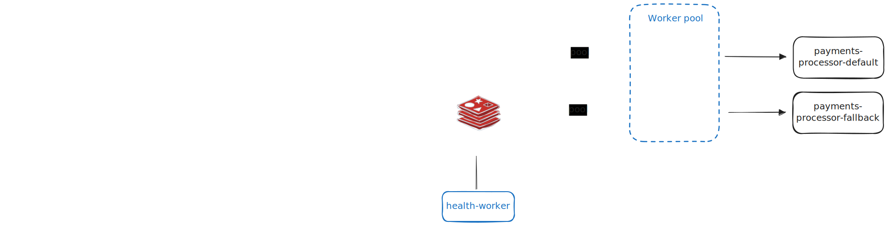

1º - Start payment-processor

2º - Start payment-life-checker

3º - Start payment-proxy

4º - Start payment-worker

---

TODO's:

    - Create prod config in docker-compose files

    - Verify how i handle with concurrency in bullmq
